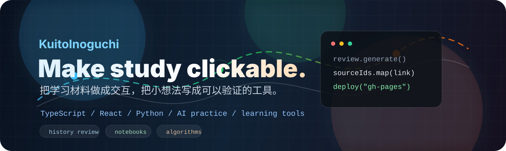

  

 

**把学习材料做成交互，把代码写成可以反复验证的东西。** 
*Turning study notes into interfaces, and small ideas into testable tools.*

## About Me / 关于我

你好，我是 **KuitoInoguchi**。我喜欢把学习、工具和一点点个人趣味揉在一起：一边做交互式复习应用，一边用 Python / Notebook 练 AI，用 Java / C 打底，也会给音乐学习和博客折腾一些小工具。

I build compact, personal tools: web interfaces for review, notebooks for AI practice, and small projects that make learning less passive.

- **Currently building:** [`hist-interactive-review`](https://github.com/KuitoInoguchi/hist-interactive-review), a TypeScript + React + Vite review app for Chinese modern history notes.
- **Recent activity:** intense iteration on `dev` and `gh-pages`, merged PR work, and a live GitHub Pages deployment.
- **Learning track:** AI practice, handwritten digit recognition, deep learning homework, algorithms, and course projects.
- **Taste:** code should explain the idea, not bury it.

## Featured Work / 代表项目

| Project | What it is | Stack |
| --- | --- | --- |
| [`hist-interactive-review`](https://github.com/KuitoInoguchi/hist-interactive-review) | 中国近现代史纲要交互式复习应用，支持题库生成、交互练习、资料定位和静态部署。 Interactive review app for history notes, with generated questions and source-linked study material. | TypeScript, React, Vite |
| [`mnist_handwriting_recognition`](https://github.com/KuitoInoguchi/mnist_handwriting_recognition) | MNIST 手写数字识别练习项目。 A machine learning practice project for handwritten digit recognition. | Python |
| [`python-for-ai`](https://github.com/KuitoInoguchi/python-for-ai) | 深度学习作业与 Notebook 实验。 Deep learning homework and notebook-based AI practice. | Jupyter Notebook, Python |
| [`Piano-Sight-Reading-Practice`](https://github.com/KuitoInoguchi/Piano-Sight-Reading-Practice) | 面向钢琴初学者的识谱练习工具。 A sight-reading helper for people learning piano. | TypeScript |
| [`LeetCode-Life`](https://github.com/KuitoInoguchi/LeetCode-Life) | 个人算法练习记录。 Personal LeetCode solutions and algorithm notes. | Java |
| [`my-blog`](https://github.com/KuitoInoguchi/my-blog) | 个人博客方向的轻量尝试。 A small personal blog experiment. | Astro |

## Tech Stack / 技术栈

## GitHub Snapshot / 活动概况

 

  Built from public repositories and recent activity. 公开仓库会说话，我只是把它们排了个版。

